> 多周期CPU pipeline相关，又名计算机体系结构笔记。

<!-- more -->

依然是在公司里做知识分享的时候写的，当时还挺喜欢小组里的这个制度的，每周都能听到一些和工作本身无关的乱七八糟的知识，虽然后来工作压力大了之后感觉大家都没有时间花心思做了。

当时选题的也是考虑到CA这门课学得好像还行，而且能和后来在信息系统安全里学到的Meltdown/Spectre攻击关联起来。

有一说一还是挺有缘的，当时信息系统安全的lab是大家分小组，然后小组里每个人再认领自己的模块做的，我刚好随到了这个和前置知识有点关系的lab，做的时候感觉也挺有意思的。

碎碎念到此结束，和这个笔记有关的[github项目](https://github.com/AshenAshes/MIPS-pipeline)在这里，有一说一我的图画得还不错吧<(￣︶￣)> 

# 指令的编码与译码

计算机是通过执行指令来处理数据的，任何一种CPU在设计的时候，就已规定好自己特定的指令系统，通过读取符合指令系统规则的机器码，来执行和实现相应的程序功能。

从高级语言到汇编语言的编译正是在这样的指令系统基础上实现的，高级语言被编译成汇编语言的方式，取决于当前系统的指令集类型。在不同的指令集系统下，同一段高级语言编译形成的汇编语言和机器码是不一样的。

## 常见的指令集

有两大常见的指令集类型，即CISC(复杂指令集)和RISC(精简指令集)，它们的区别在于，CISC的指令复杂度高，一条指令可能需要多个CPU周期才能完成，且指令长度不固定，很多复杂指令的使用率低，但单个指令的能力强，比如一些单个指令甚至支持乘法与除法，这在RISC指令集下是需要多条指令才能完成的功能。而RISC指令大部分功能比较简单，单个CPU周期即可完成，且指令长度固定，指令的使用率比较高。

而具体的比较常见的指令集又有以下四种：

*   ARM：属于RISC指令集，几乎所有的移动设备芯片都是基于ARM架构，比如高通、苹果、联发科的芯片。其具有低功耗、低成本的特点，通常的安卓/iOS智能机处理器芯片几乎全是基于ARM架构。在桌面端，还比较少见，但苹果也推出了基于ARM架构的M1芯片。

*   x86：属于CISC指令集，几乎在桌面端和服务器端达到了统治级别的地位。功能强大，代表厂商有Intel、AMD。Windows与Intel的联合，也使得x86架构在win生态下的地位几乎无可撼动。

*   MIPS：属于RISC指令集，最早是在80年代初期由斯坦福大学的研究小组所开发的。因其设计简洁易懂，所以经常被引用于大学计算机设计的教材中。但商业化进程远不如ARM与x86，一般应用于各类嵌入式设备中。中科院自主研发的龙芯，其LoongISA指令集同样基于MIPS发展而来。

*   RISC-V：属于RISC指令集，近年来异军突起的新兴指令集架构，在2014年才发布。与前三个指令集因商业化的性质需要收费不同，RISC-V选择了开源、永久免费。

值得一提的是，MIPS的创始人John Hennessy和RISC-V之父Dave Patterson渊源颇深。 两人合作撰写了2本现在被广泛用于本科生、研究生课程的教科书：《计算机组成与设计：硬件/软件接口》和《计算机体系结构：量化研究方法》，书中涉及了MIPS和RISC-V指令集相关的计算机设计。2017年，两人一起获得了当年的图灵奖。


## 编译过程

### 高级语言->汇编语言

以下展示了同一段C代码在不同指令集架构下编译生成的不同汇编代码：

```c
//C语言
for(i=n;i!=0;i=i-1) {
    ...
}
```

```mips
;MIPS指令集
Loop:
    ...
    addi  $t0, $t0, -1  ;$t0=$t0-1
    bne   $t0, $zero, Loop  ;if $t0 != 0 go to Loop
```

```x86asm
;x86指令集
Loop:
    ...
    dec  $rax  ;$rax = $rax-1
    test $rax, $rax ;if $rax=0, set Zero Flag(ZF) = 1
    jnz Loop   ;if Zero Flag(ZF) != 0 go to loop
```

由于指令集的不同，在不同架构下编译生成的汇编语言不同，最后所形成的机器码也就不一致。

### 汇编语言->机器码

指令集可以看作是对机器码的解析或者生成规则，计算机以二进制01的形式存储数据，如果没有一个约定俗称的编码和译码方式，那么这些01数据就会变得对人类来说难以阅读和使用。

ARM和MIPS指令集的差异：

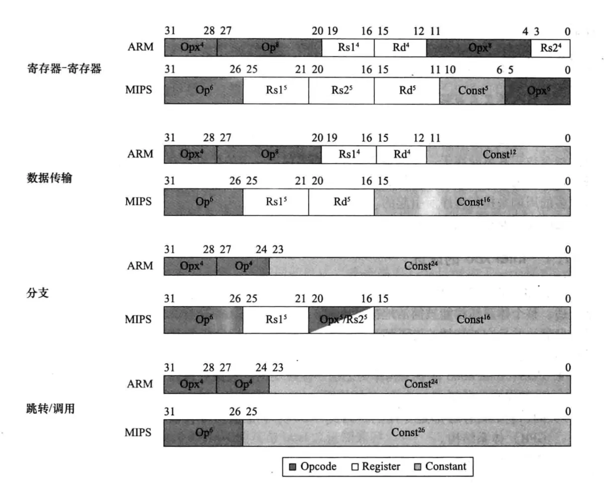

根据这样的规则，我们就可以将如下的MIPS指令译码成计算机可理解的机器码

```mips
;MIPS指令
add $t0, $s2, $t0

;属于寄存器-寄存器规则
000000 10010 01000 01000 00000 100000 //32 bits
  op    rs    rt    rd   shamt  funct
Op:指令的解析类型
Rs:第一个寄存器操作数
Rt:第二个寄存器操作数
Rd:保存结果的寄存器
Shamt:地址偏移量
Funct:指令符号
```

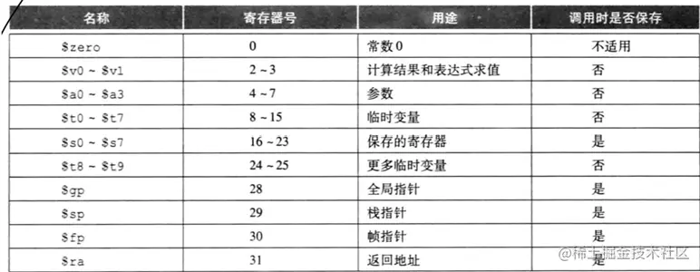

同理，计算机CPU也根据这样的规则，将机器码译码，并执行相应的操作。


### 程序的执行

一个程序的执行，正是通过计算机读取这一行行的机器码，并根据当前系统的指令集类型，解析出相应的指令，并进行对应的寄存器读取、计算、内存读写等操作。

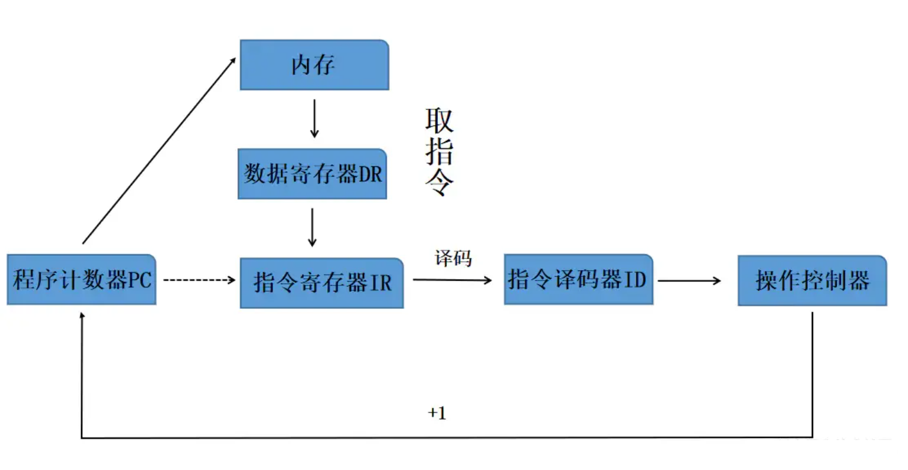

在一个经典的CPU架构中，程序计数器PC指向了指令的内存地址，CPU根据PC指向的地址在内存中读取指令，并将读取到的指令进行译码(也就是我们上述所说的计算机根据op类型去解析指令)，解析出的指令会包含指令操作码与指令操作数，操作码指示了指令应完成何种操作，而操作数则提供了参与运算的数据、读写地址等相关信息。将解析出的内容传递给操作控制器，它会根据指令内容进行相应的操作。


对于MIPS指令集而言，常见的指令类型主要分为以下几种：

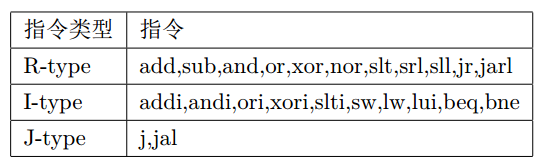

举个栗子，一个add指令是如何在CPU中被解析并执行的：

1.  PC存储了当前要执行的指令地址addr，CPU到addr这个地址取到了一串机器码，这串机器码为：00000010010010000100000000100000

2.  CPU开始译码，首先读取前六位000000，这代表了指令类型，000000说明该指令是一个R型指令，R型指令的解析规则如下：

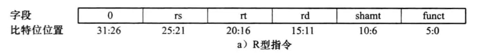

3.  根据该解析规则，CPU成功译码出了如下内容：

```
000000 10010 01000 01000 00000 100000
  op    rs    rt    rd   shamt  funct
```

4.  根据R型指令的规则，rs和rt代表了要读取的寄存器编号，funct代表要对这两个寄存器进行运算的运算类型，（shamt在移位指令中会用到，这里不考虑）。假设\$rs=1，$rt=2，那么CPU会首先读取这两个寄存器中的内容1和2，然后给**运算单元ALU**作为输入。

5.  这里的funct=100000代表了加操作，**运算单元ALU**进行加法计算，得到结果3

6.  rd代表了结果存储的目的寄存器，运算结果3会被写入寄存器rd中，至此，该指令操作结束

# 单周期CPU

举例的add操作是一个顺序执行的流程，并且分点之间不能并行执行，我们可以提炼出一个R型运算指令执行顺序的模型。

1.  读指令

2.  译码并读寄存器

3.  运算操作

4.  回写寄存器

假设每一步都花费一个单位时间，那么执行一个add指令，就需要4个单位时间。

由于各个指令的复杂性不同，所要花费的时间是不一致的。如果是简单的J型指令（指令地址跳转），只需要花费3个单位时间：

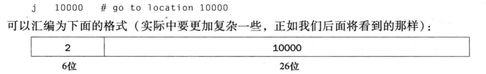

1.  读指令

2.  译码并计算指令跳转地址

3.  将跳转地址传递给PC

而一些复杂的I型指令，比如内存读取相关的lw（读一个内存地址中的内容并存储到一个寄存器中），则需要花费5个单位时间：


1.  读指令

2.  译码并读寄存器

3.  计算内存地址 ALU

4.  读内存

5.  回写寄存器


计算机所有的操作都是以时钟周期为单位的，一个时钟周期内进行一个操作，而时钟周期的长度是固定的。如何确定计算机的时钟周期长度？由于指令是顺序执行的，并且指令间可能存在读写冲突，我们不能调换或者并行执行指令，所以我们可以以一个指令的执行时间作为一个时钟周期。

那么在上述情况中，以最复杂的指令的执行时间作为一个时钟周期，就能确保所有的指令都能在一个时钟周期内执行完成。这一个时钟周期就是5个单位时间，这种CPU就被称作是单周期CPU。它的时钟周期是以一个指令级别的长度来确定的。

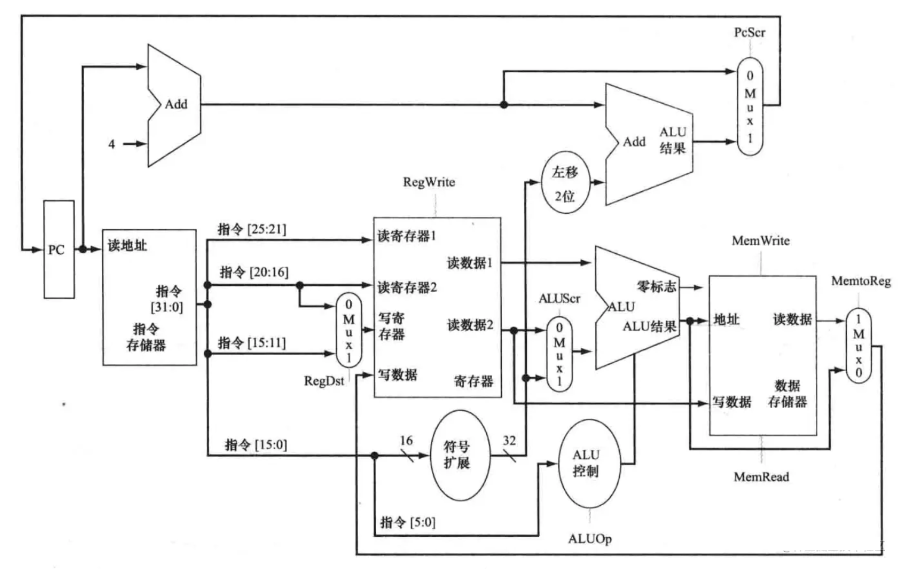

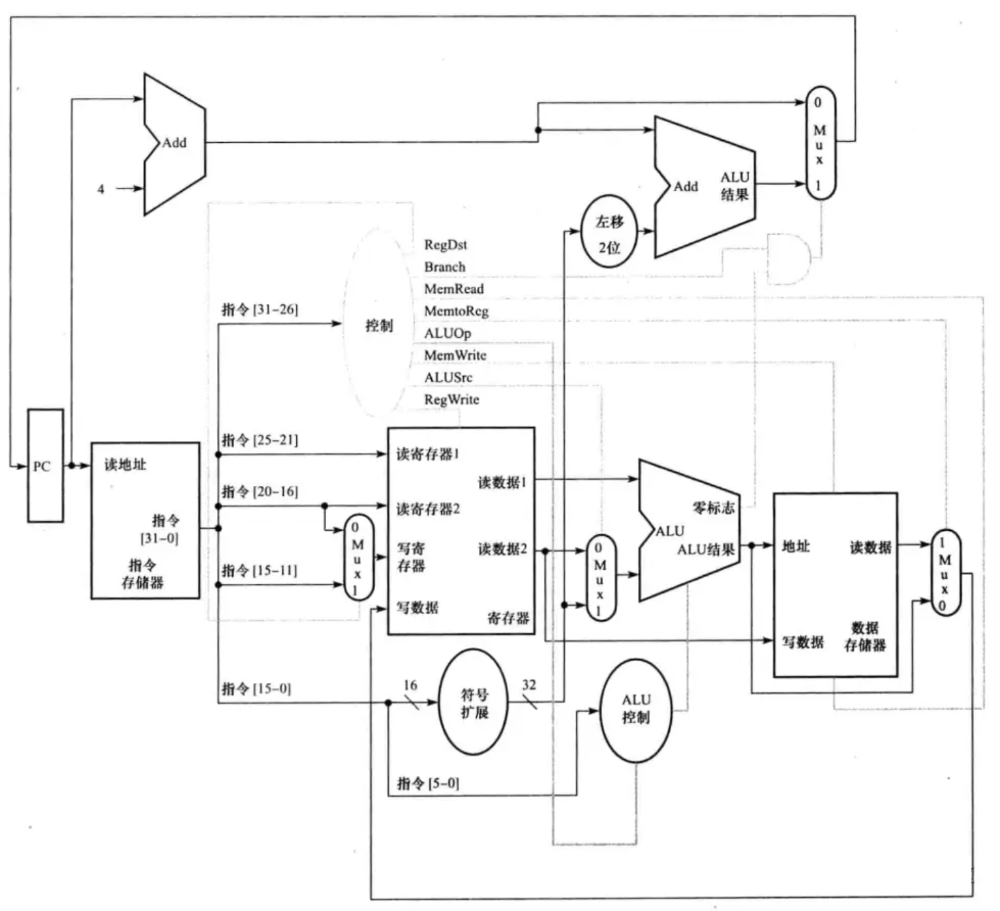

显而易见地，这样的CPU执行效率很低，因为它在执行简单指令时，也需要花费相当于复杂指令的执行时间。


# 多周期CPU

在之前，我们已经对指令进行了单位时间级别的划分，那么我们可以直接把一个单位时间作为一个时钟周期，指令的每一小步都花费一个时钟周期。共有的时钟周期越小，单位时间内CPU所能执行的操作量就越大。这样的CPU被称作是多周期CPU，它的时钟周期是以一个指令内操作执行时间的级别来确定的。

为何确认这样的时间长度作为一个时钟周期？

多周期CPU的时钟周期不能太长，否则它的执行效率和单周期CPU没有区别。

多周期CPU的时钟周期不能太短，否则一个基础操作也要花费多个时钟周期完成，调度的开销成本会上升。

## 流水线

事实上，一个MIPS指令通常会经历下面5个流程：

1.  从指令存储器中读取指令

2.  指令译码并同时读取寄存器

3.  执行操作或计算地址

4.  读/写数据存储器

5.  将结果写回寄存器

这与我们之前的划分相类似，为了降低管线的复杂度，我们可以假定每一条指令都处于这样的一个流程中，每一个时钟周期，执行一步流程。这样划分的好处还有，我们不必等待一条指令完整执行完成再执行下一条指令，当指令A处于流程2时，它的下一条指令也可以开始进入流程1开始执行。这样的思想就被称作是流水线（pipeline）。

以图的形式表示，单周期和多周期流水线CPU的区别如下：

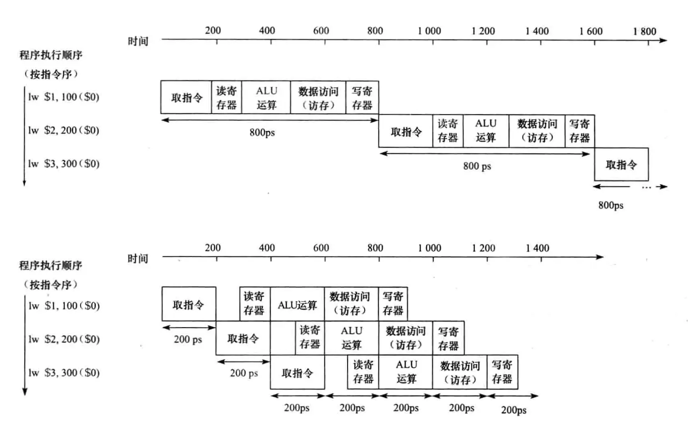

可以看到，多周期流水线执行下，总体花费时间相较于单周期CPU大大缩短。


## 冒险

虽然流水线的指令执行方式大大提高了CPU的执行效率，但也引入了一定的风险。在单周期CPU中提到过，指令间可能存在读写冲突，所以单周期CPU的选择是指令串行执行，如果按流水线的方式执行，显然会引入这种风险。这种情况被称作是流水线冒险。

### 结构冒险

读写操作会发生在指令执行过程中接触到的两个结构，即存储器和寄存器。

流水线中，在第一阶段的取指令中会读取存储器，在第四阶段中会读/写存储器。为了规避这种冒险，流水线中将存储器分为了指令存储器和数据存储器，规避了读写冲突。

至于寄存器，在第二阶段会读取寄存器，在第五阶段会回写寄存器，这种冒险无法像存储器那样解决，因为两阶段读写的寄存器可能会是同一个。但是，由于对寄存器的访问速度会明显快于对存储器的访问，一般来说，一个时钟周期内可以支持进行多次寄存器的读写，所以我们可以将写寄存器的操作放在时钟周期的前半段进行，将读寄存器的操作放在时钟周期的后半段进行。

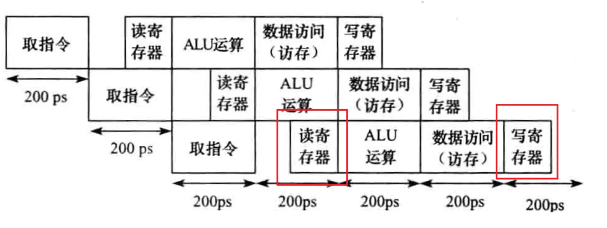

### 数据冒险

数据冒险指的是一条指令依赖于它之前的还在流水线中的指令的数据，比如在下面这种case中，第二条指令要读的寄存器与第一条指令要写的寄存器是同一个，但当第二条指令执行到第二阶段时，第一条指令应写入的数据还未写入相应的寄存器，这时候读寄存器读到的就是错误的数据。

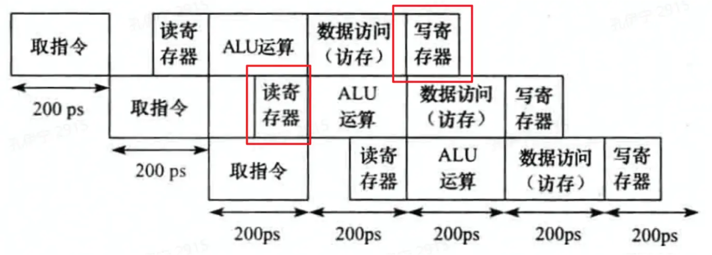

这种时候，必须暂缓第二条指令的执行，在第一与第二条指令间插入两个空指令，来暂缓读取操作的执行。等到第一条指令将数据写入对应寄存器中时，再执行第二条指令的读取操作。这两个空指令一般被称作bubble（气泡）。

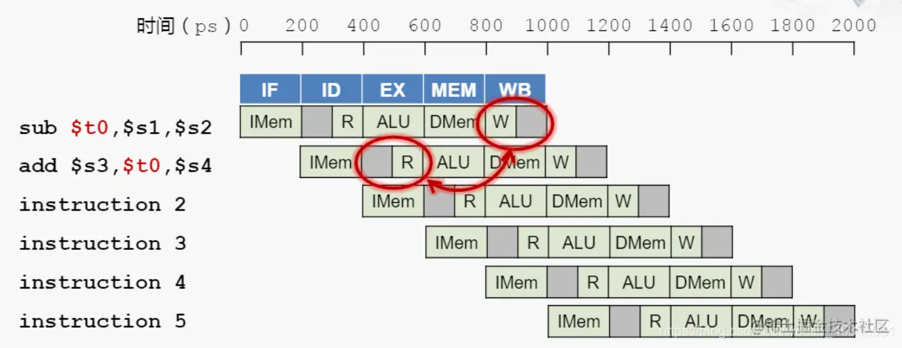

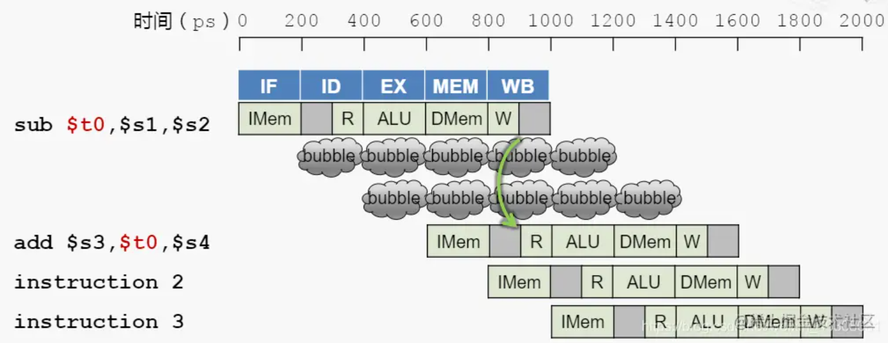

### 分支冒险

分支冒险的产生与一些分支指令or地址跳转指令有关，指令的执行顺序由于分支产生或者地址跳转产生而变得不确定，在高级语言中，通常表现为if-else的分支和一些代码的jump操作，导致代码的执行顺序变得不确定。而在我们的MIPS流水线中，则是由于分支指令beq、bne等和一些跳转指令j、jr等所导致的。

下一步要执行哪个指令，需要等到分支指令决定执行哪一个分支or跳转指令计算出跳转地址，才可以确定。这会产生一个阶段的bubble阻塞。

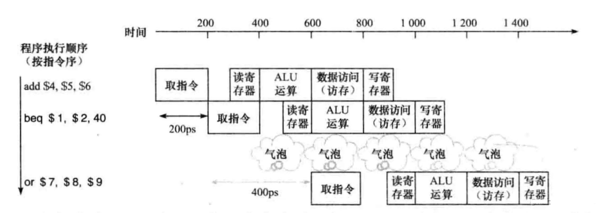

## 优化

实际CPU运行中，由于顺序执行的代码间大多存在逻辑关系，顺序执行的指令间会产生大量的数据冒险，或者由于代码间大量的分支或者跳转产生分支冒险，进而产生bubble，这严重阻碍了CPU的运行，导致CPU浪费了大量时间在bubble上。如何减少bubble的产生，是流水线CPU的一个优化方向。

### 数据冒险：前推

前推指的是，将发生数据冒险时前面指令要写的数据提前给后面的指令（此时寄存器的新数据已经产生，只是还未写入寄存器），这条传递数据的通路就被称作是前推，也叫旁路。

通常有三种前推的情况：

1.  处于ID阶段的指令要读的寄存器与处于EXE阶段的指令要写的寄存器是同一个，且处于EXE阶段的指令不是lw（读取内存数据并写寄存器），这时候ID阶段要读的内容其实就是现在EXE阶段里运算单元的输出结果。这里建立了一条从EXE输出到ID读取输出的通路。

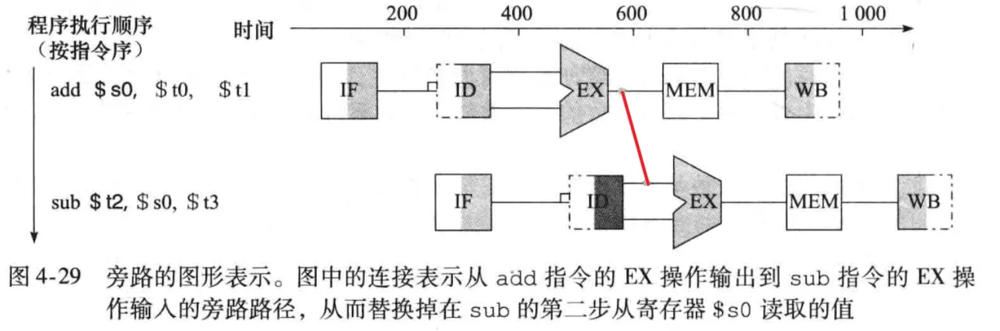

2.  处于ID阶段的指令要读的寄存器与处于MEM阶段的指令要写的寄存器是同一个，且处于MEM阶段的指令不是lw（读取内存数据并写寄存器），这时候ID阶段要读的内容其实就是现在MEM阶段的传入数据，这个数据在EXE阶段就已经计算好了，只是现在被传递到了MEM阶段。这里建立了一条从MEM输入到ID读取输出的通路。

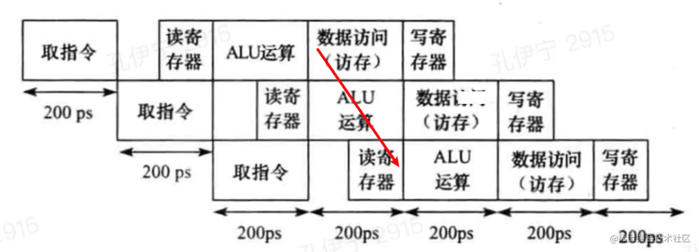

3.  处于ID阶段的指令要读的寄存器与处于MEM阶段的指令要写的寄存器是同一个，且处于MEM阶段的指令是lw（读取内存数据并写寄存器），这时候ID阶段要读的内容其实就是现在MEM阶段从存储器读取的数据。这里建立了一条从MEM输出到ID读取输出的通路。

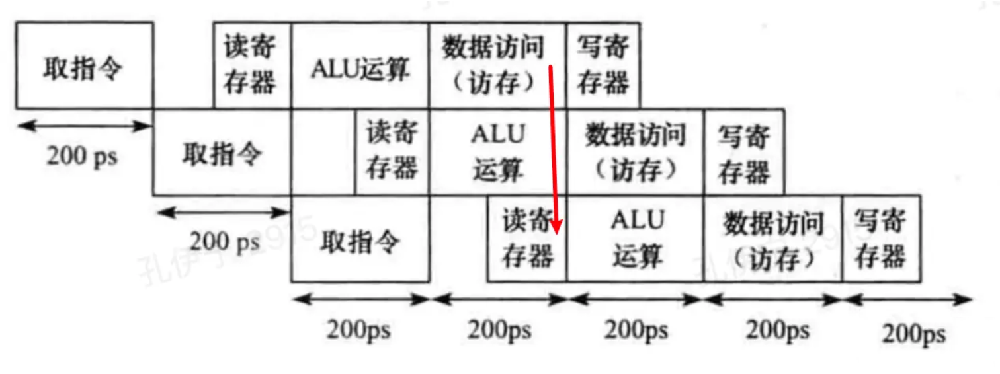

至此，我们优化了大部分会产生bubble的情况，使得流水线能正常运行而不停滞。现在只剩下一种情况还会产生bubble，那就是：

处于ID阶段的指令要读的寄存器与处于EXE阶段的指令要写的寄存器是同一个，且处于MEM阶段的指令是lw（读取内存数据并写寄存器）。这时候后面的指令要读取的新数据还未产生，要等处于EXE阶段的指令执行完存储器数据读取的操作，才能获取到最新值，这种情况下，流水线会产生一个阶段的bubble。将这种情况变为前推路线的第三种情况：

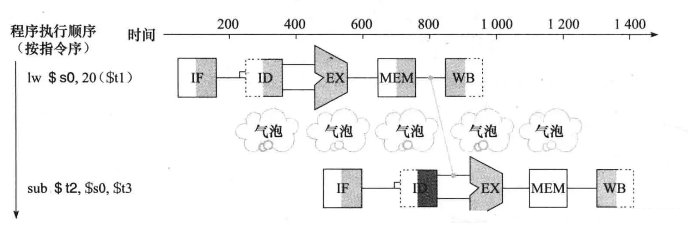

### 分支冒险：预测

对于无条件跳转的指令，我们只能等待跳转地址计算完成，所以这种情况是一定会产生一个bubble的。

但对于分支指令，会有跳转与不跳转的情况，我们可以预测分支指令的跳转结果。比如预测它不发生跳转，它的下一条指令就是指令存储器中的下一条指令，假如预测正确，我们就规避了一个bubble的产生，假如预测错误，清空下一条指令的执行，并将下下条指令置为跳转指令，这样也只产生了一个bubble，情况没有变得更坏。

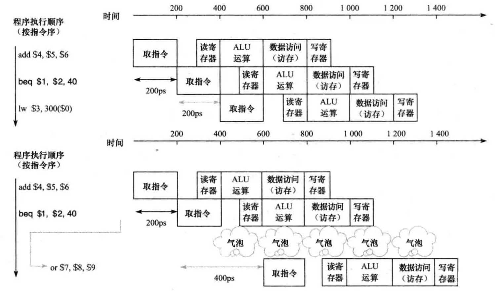

在更高级的CPU预测执行中，我们可以动态地预测指令，即预测一部分指令跳转，预测另一部分指令不跳转。比如对于循环体结构，我们往往预测发生跳转，且跳转到循环体的顶部。


至此，多周期流水线CPU的基本概念与思想大致都解释了。以下是一个流水线CPU结构的概略图，并没有覆盖所有通路细节：

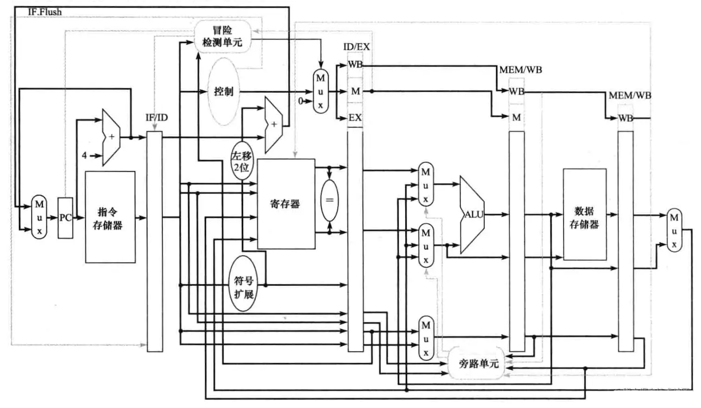

我画的一个多周期CPU通路图（有点乱，见谅）：

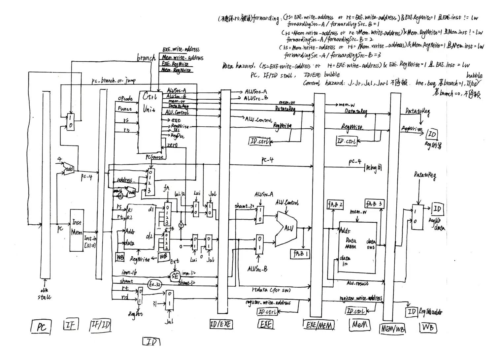


## 高级流水线技术

- 指令级并行：流水线架构本身就是一种指令级并行，本次我们划分了五级流水线。通过增加流水线的深度以重叠更多的指令，可以进一步增加指令级并行的程度。

- 多发射：复制CPU内部组件的数量，使得每个流水级可以执行多条指令，一般实现方式有静态多发射和动态多发射。

    * 静态多发射：在编译阶段就决策哪些指令进行多发射

    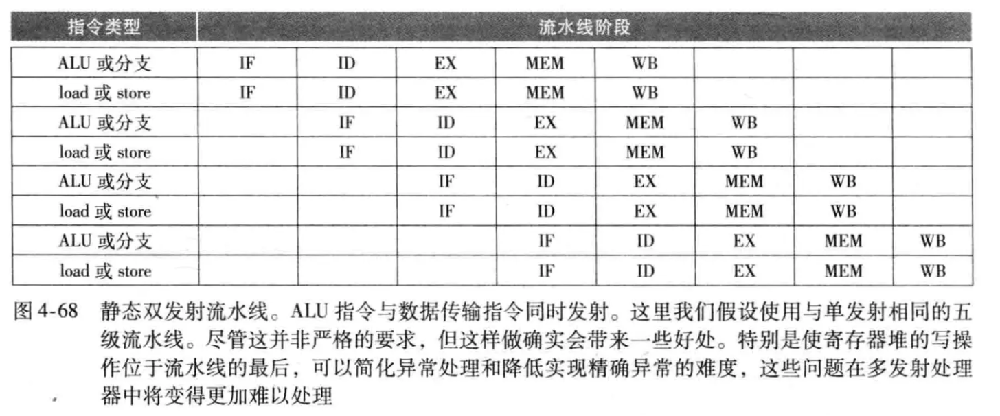

    - 动态多发射：CPU在执行阶段决定多发射哪些指令

        - 超标量：使每个周期处理器能执行的指令数超过一条

        - 动态流水线调度：对指令进行重排序以避免阻塞的硬件支持

这些以及其他高级流水线技术的具体实现在《计算机体系结构：量化研究方法》有更详细的解释，感兴趣可以阅读。


### CPU实例

**Intel Core i7 920**

属于x86架构，具有14级流水线，使用了动态多发射、乱序执行和推测执行的动态流水线调度技术。

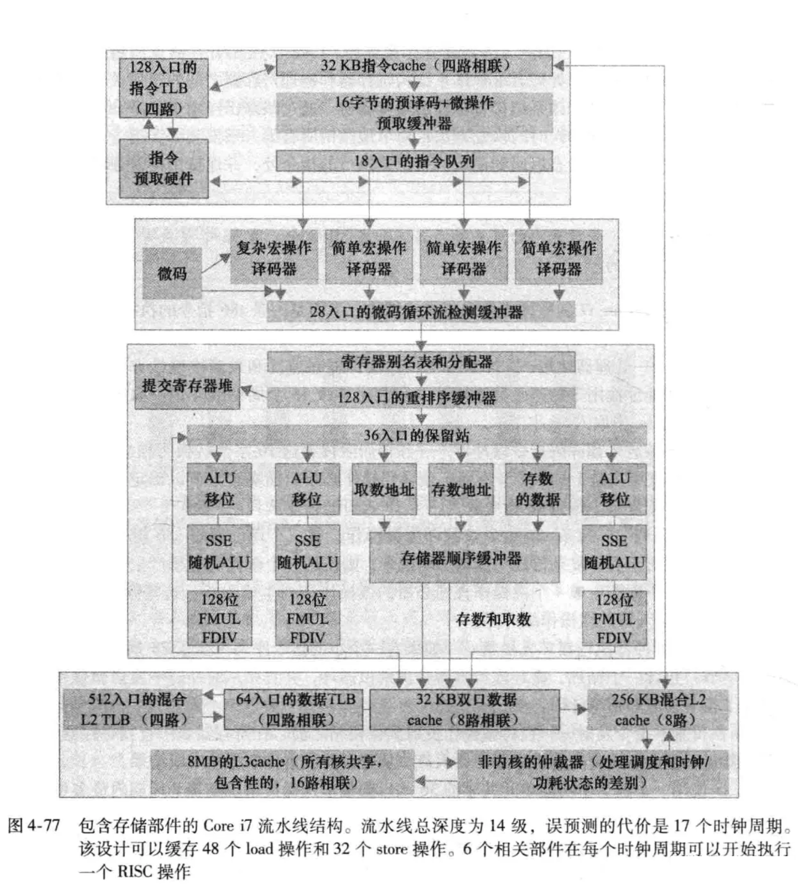

# 安全风险

## CPU芯片漏洞：Meltdown\&Spectre攻击

我们通常认为计算机处理器就是一台完全有序的机器，执行着一条条简单的指令。但事实是，数十年来，它们的运行方式都是无序的，是在猜测下一步应该是什么。在过去大约25年的时间里，大多数计算能力的提升都依赖这种被称为“推测执行”的功能。但是2018年1月3日，人们发现，这种为现代计算做出了巨大贡献的技术却成了最大的漏洞之一。

2017年期间，Cyberus Technology公司、谷歌零点项目、格拉茨技术大学、Rambus公司、阿德莱德大学及宾夕法尼亚大学的研究员们，以及密码技术人员保罗•克奇等独立研究人员，分别发现了**利用推测执行进行黑客攻击**的方式。

名为Meltdown和Spectre的这些类型的攻击绝非一般故障。最初被发现的时候，Meltdown能够攻击所有的英特尔x86微处理器、所有的IBM Power处理器以及部分ARM处理器。Spectre及其多种变体的攻击范围还包括超威半导体（AMD）的处理器。也就是说，几乎全世界所有的计算都容易遭到攻击。

Meltdown攻击是一种直接针对底层硬件机制（CPU的乱序执行机制、Cache机制和异常处理机制）的时间侧信道攻击，攻击原理如下：

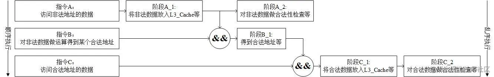

这一段顺序执行的代码可用伪代码表示如下：

```c
if (鉴权并访问内核地址中的数据secret) {
    temp = secret*1024+2048
    访问数组array[temp]并重置它的值为n
}
```

# 参考资料

1.  [X86 / ARM / RISC－V / MIPS四大主流指令集架构有何特点](https://ee.ofweek.com/2021-06/ART-8320315-11000-30502562\_1.html)

2.  《计算机组成与设计：硬件/软件接口》J.L.Hennessy & D.A.Patterson

3.  SEED Labs

    1.  https://seedsecuritylabs.org/Labs\_20.04/System/Meltdown\_Attack/

    2.  https://seedsecuritylabs.org/Labs\_20.04/System/Spectre\_Attack/

