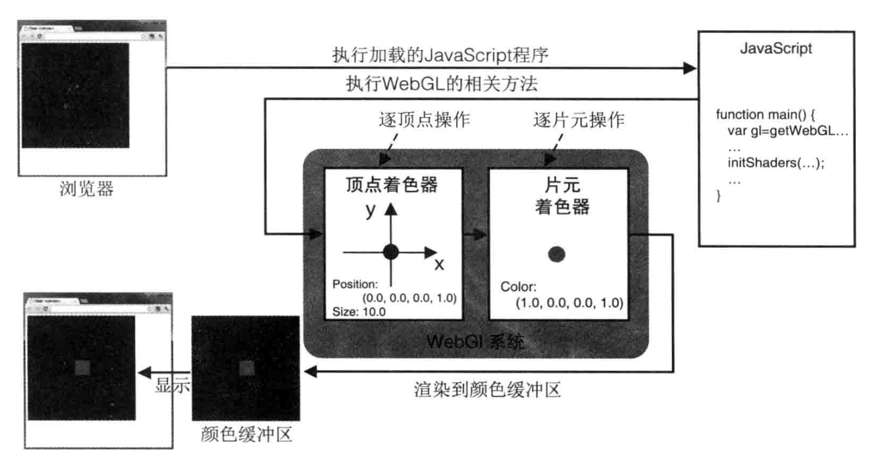
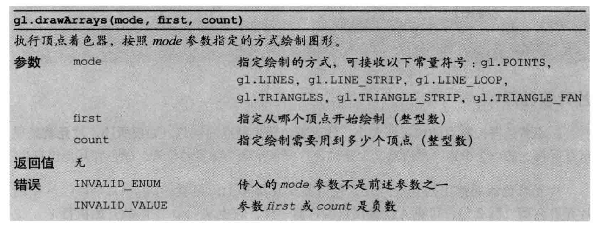
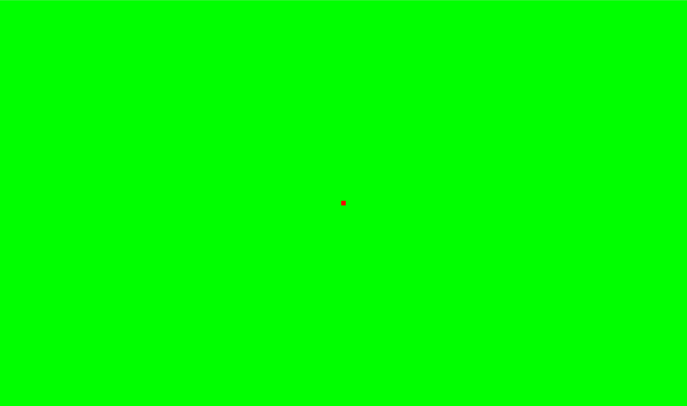

> 在这悲哀的山巅，请用你的眼泪诅咒我、祝福我，不要温和地走入那个良夜。

<!-- more -->

作为与[项目](https://github.com/AshenAshes/WebGL-MidSummer_Night)一致的记录而存在。

是对曾经没有时间完善的WebGL项目的追溯，也是一个重新学习原生WebGL的过程。

&emsp;&emsp;

## 创建与设置画布

我们用H5新引入的`<canvas>`标签作为绘图区域，它允许JavaScript动态绘制图形。由于canvas是透明的，在canvas间加入的信息只会在不支持WebGL的浏览器上显示，这可以作为错误提示。

对canvas内容的操作与绘制将通过JavaScript代码来实现，我们可以用`<script></script>`标签引入对应的JS代码。

用body标签指定JS程序的入口。

```html
<!-- index.html -->
<!DOCTYPE html>
<html lang="en">
  <head>
    <meta charset="utf-8" />
    <title>WebGL</title>
    <script src="./lib/jquery-3.3.1.min.js"></script>
    <link rel="stylesheet" type="text/css" href="./css/style.css">
    <!-- <script type="text/javascript" src="./js/windowResize.js"></script> -->
  </head>

  <body onload="main()">
    <canvas id="canvas">
      Please use a browser that supports "canvas"
    </canvas>
    <script src="./js/draw.js"></script>
  </body>
</html>
```

&emsp;

我们预想的canvas应该自适应撑满整个屏幕，曾经在写类似前端需求时碰到过一个问题，就是会有高度上的滚动条出现，为了解决这个问题，抄了一些网上的css，使canvas的宽度和高度都可以适应全屏幕。对了，为了代码的可阅读性，html文件在根目录，其他所有的css,js,之后的着色器、model等都将独立设置子目录。

css代码如下：

```css
/* style.css */
html,body,canvas {
  width: 100%;
  height: 100%;
  font-family: Monospace;
  background-color: #000;
  color: #000;
  margin: 0px;
  padding: 0px;
  overflow: hidden;
}

* {
  margin: 0;
  padding: 0;
}

canvas {
  display: block;
}
```

&emsp;

加入这段代码后，你会发现body所在的区域全都变成黑色了，并且没有滚动条出现。但当用F12开发者工具观察时，你会发现canvas所在区域的高度并没有占满整个屏幕。这时候我们需要用到JQuery来动态设置canvas的高度。注意，使用JQuery要引入JQuery文件，我把它放在了/lib文件夹里。

你可以选择监听窗口的大小变化然后实时刷新canvas的size，注意每次刷新后都会丢失canvas的内容，需要重新绘制。注释掉的windowResize.js即为动态刷新的代码，如下所示：

```js
//windowResize.js
$(function(){
  $(window).resize(resizeCanvas);
  resizeCanvas();
});

function resizeCanvas(){
  $("canvas").attr("width", $(window).get(0).innerWidth);
  $("canvas").attr("height", $(window).get(0).innerHeight);
};
```

&emsp;

不过我暂时没有想好把canvas和window一起重绘的代码放在哪里，所以这里我采用了只在window初始化的时候确定canvas的size，所以这段代码被放在了main的初始化阶段。和绘制的代码放在一起，便于我观察测试：

```js
//draw.js
function main(){
  var canvas = document.getElementById('canvas');
  if(!canvas){
    console.log('Failed to get the <canvas> element');
    return ;
  }

  //自适应一开始的页面大小
  $("canvas").attr("width", $(window).get(0).innerWidth);
  $("canvas").attr("height", $(window).get(0).innerHeight);

  var context = canvas.getContext('2d');

  context.fillStyle = 'rgba(0, 0, 255, 1.0)';
  context.fillRect(100, 100, 200, 100);
}
```

&emsp;

## 尝试绘制

绘制主要通过js进行，代码已经在上面的draw.js里了。我们首先通过id获取canvas对象，但绘制并不是直接通过canvas对象进行的，而是由canvas提供的上下文对象(context)来进行的。getContext参数指定了绘制对象的类型是2d还是3d，这里我们测试画的是一个矩形，所以是2d对象。

fillStyle可以理解为画笔颜色，这里用的是Alpha=1.0的蓝色。RGB的范围都是0-255，alpha的范围是0-1.0。

关于WebGL的坐标系统，原点在屏幕左上角，x轴从左到右，y轴从上到下。fillRect方法前两个参数是矩形的左上角坐标，后两个参数对应矩形的x轴方向长度和y轴方向长度(即宽度和高度)。

绘制效果如下图所示：


这只是一个尝试在canvas上绘制图形的过程，真正的WebGL编程远比这个繁琐。

## 着色器相关

### 函数库
注意，从这里开始我们将引入参考资料里的一些程序，这些程序大都是一些事先定义好的函数库，方便我们获取一些对象，隐去不同浏览器之间的差异，但是我们的主要编程部分仍然是遵循原生WebGL的主旨。

同时，为了避免以后不同函数库之间命名冲突的问题(曾经给我的CG大程造成了很大的麻烦)，我将建立自己的函数库，大致考虑分为两个，一个是WebGL-utils.js，注重于WebGL方面的初始化过程，另一个是math-utils.js，注重矩阵计算方面。有一个叫WebGL-debug.js的东西是用来显示debug信息的，这个是从参考资料代码里照搬的。

&emsp;
### 着色器
着色器是WebGL最重要的概念之一，绘图过程必须用到着色器。WebGL需要两种着色器——顶点着色器(Vertex Shader)和片元着色器(Fragment Shader)，用GLSL语言编写。

顶点着色器是用来描述顶点特性(如位置、颜色等)的程序。片元着色器进行逐片元处理过程(如光照)。绘图的过程是，浏览器执行JS程序——JS执行WebGL相关方法——顶点着色器逐顶点操作，片元着色器逐片元操作——渲染到颜色缓冲区——显示在浏览器上。



不过虽然着色器代码是用GLSL语言编写的，创建着色器对象的过程中，程序接收的必须是字符串类型的对象，下面将介绍三种在JS代码中插入GLSL代码并创建着色器的方式。

&emsp;
### 用字符串存储着色器
在参考资料书中，用到的都是这一种。直接在js代码内用字符串变量存储GLSL代码。

```js
// Vertex shader program
var VSHADER_SOURCE = 
  'void main() {\n' +
  '  gl_Position = vec4(0.0, 0.0, 0.0, 1.0);\n' + // Set the vertex coordinates of the point
  '  gl_PointSize = 10.0;\n' +                    // Set the point size
  '}\n';

// Fragment shader program
var FSHADER_SOURCE =
  'void main() {\n' +
  '  gl_FragColor = vec4(1.0, 0.0, 0.0, 1.0);\n' + // Set the point color
  '}\n';

function main() {
  ...

  // Initialize shaders
  if (!initShaders(gl, VSHADER_SOURCE, FSHADER_SOURCE)) {
    console.log('Failed to intialize shaders.');
    return;
  }

  ...
}
```

initShader()函数是函数库WebGL-utils.js中的一个函数，如果你对WebGL如何创建着色器的过程不感兴趣，你可以直接调用这个函数，忽略内部细节。注意第二第三个参数必须为字符串。

使用'\n'而不是直接用长字符串的原因是，这样做，当着色器内部出错时，就能获取出错的行号，对检查源代码错误很有帮助。

这种方法只适用于简单程序，书写很麻烦，创建和维护难度大。

&emsp;
### 内嵌于html代码中

这种方法在网上的各种教程中很常见，通过设置`<script>`标签的type使得浏览器将内容视为数据块，不作为JS代码执行。

```html
    <script id="vertex-shader" type="x-shader/x-vertex">
      void main(){
        gl_Position = vec4(0.0, 0.0, 0.0, 1.0); //设置坐标
        gl_PointSize = 10.0;  //设置尺寸
      }
    </script>
    <script id="fragment-shader" type="x-shader/x-fragment">
      void main(){
        gl_FragColor = vec4(1.0, 0.0, 0.0, 1.0);  //设置颜色
      }
    </script>
```

在JS代码中还要将标签内容转为字符串，具体代码可以参考以下(这里的代码其实包含了创建着色器的内部细节，如果不想关心，可以将initShaders函数放到函数库里，传给函数的第二三个参数是着色器代码所在script标签的id)：

```js
function main(){
    ...
    program = initShaders(gl, "vertex-shader", "fragment-shader");
    gl.useProgram(program); // 启用该shader程序对象 
    ...
}

function initShaders( gl, vertexShaderId, fragmentShaderId )
{
    var vertShdr;
    var fragShdr;

    var vertElem = document.getElementById( vertexShaderId );
    if ( !vertElem ) { 
        alert( "Unable to load vertex shader " + vertexShaderId );
        return -1;
    }
    else {
        vertShdr = gl.createShader( gl.VERTEX_SHADER );
        gl.shaderSource( vertShdr, vertElem.text );
        gl.compileShader( vertShdr );
        if ( !gl.getShaderParameter(vertShdr, gl.COMPILE_STATUS) ) {
            var msg = "Vertex shader failed to compile.  The error log is:"
          + "<pre>" + gl.getShaderInfoLog( vertShdr ) + "</pre>";
            alert( msg );
            return -1;
        }
    }

    var fragElem = document.getElementById( fragmentShaderId );
    if ( !fragElem ) { 
        alert( "Unable to load vertex shader " + fragmentShaderId );
        return -1;
    }
    else {
        fragShdr = gl.createShader( gl.FRAGMENT_SHADER );
        gl.shaderSource( fragShdr, fragElem.text );
        gl.compileShader( fragShdr );
        if ( !gl.getShaderParameter(fragShdr, gl.COMPILE_STATUS) ) {
            var msg = "Fragment shader failed to compile.  The error log is:"
          + "<pre>" + gl.getShaderInfoLog( fragShdr ) + "</pre>";
            alert( msg );
            return -1;
        }
    }

    var program = gl.createProgram();
    gl.attachShader( program, vertShdr );
    gl.attachShader( program, fragShdr );
    gl.linkProgram( program );
    
    if ( !gl.getProgramParameter(program, gl.LINK_STATUS) ) {
        var msg = "Shader program failed to link.  The error log is:"
            + "<pre>" + gl.getProgramInfoLog( program ) + "</pre>";
        alert( msg );
        return -1;
    }

    return program;
}
```

但我觉得把GLSL代码放在html里还是不好管理，html代码的可读性变差了，还是放在文件里容易维护，于是就有了第三个方法。

&emsp;
### 从文件加载着色器
从文件加载着色器需要创建一个XMLHttpRequest对象request来加载指定文件，事实上后面我们加载model时也要用到类似方法。可以将加载着色器的过程视作一个资源加载的过程，甚至我是在获取canvas对象之前加载的，因为加载过程和绘图无关。

fileName指定了文件加载的路径，记得采用相对路径。onLoadShaderFile是注册的事件响应函数，它将在文件加载完成时被调用。加载的着色器代码被作为字符串对象存储，当两者都加载完成时，回到main()函数进行下一步操作。

关键代码如下：
```js
function loadShaderFile(fileName, shader){
  var request = new XMLHttpRequest();

  request.onreadystatechange = function() {
    if(request.readyState === 4 && request.status !== 404){
      onLoadShaderFile(request.responseText, shader);
    }
  }
  request.open('GET', fileName, true);
  request.send();
}

function onLoadShaderFile(fileString, type){
  if(type == 'VERTEX_SHADER'){
    VERTEX_SHADER = fileString;
    console.log("vertex shader:" + VERTEX_SHADER);
  }
  else if(type == 'FRAGMENT_SHADER'){
    FRAGMENT_SHADER = fileString;
    console.log("vertex shader:" + FRAGMENT_SHADER);
  } 

  if(VERTEX_SHADER && FRAGMENT_SHADER){
    FLAG_SHADER_LOADED = true;
    main();
  }
}
```

从文件加载意味着我们可以比较方便地管理多个着色器对象，这对WebGL高级编程或许有意义(我还没学到hhh)。

&emsp;
至此,我们了解了三种加载着色器的方式，但对着色器内部代码的意义，以及如何使用着色器进行绘制还没有涉及。下面将通过一个简单的程序来说明。

&emsp;
## 简单的WebGL程序
下面我们将绘制一个最简单的图形——一个位于原点的10个像素大的红色的点。实际效果中将为一个矩形，因为对WebGL来说绘制矩形比绘制圆更快。

&emsp;
### 顶点着色器
顶点着色器定义了点的相关性质，在这里我们定义了点的位置和大小：

```glsl
void main(){
  gl_Position = vec4(0.0, 0.0, 0.0, 1.0); //设置坐标
  gl_PointSize = 10.0;  //设置尺寸
}
```

gl_Position和gl_PointSize是顶点着色器内置的变量，你必须传值给这两个变量。不同于JS，GLSL是一种强类型的语言，gl_Position的类型是vec4，相当于长度为4的矢量，每个值的类型都是float。它表示顶点的齐次坐标。gl_PointSize的类型也是float，所以这里的10.0不能写成10。vec4是GLSL内置的构造函数，在JS里，通过math-utils.js的函数库，我们也创建了类似的一连串的vec2,vec3,vec4的构造函数。

&emsp;
### WebGL坐标系
与canvas坐标系不同，WebGL坐标系的原点在canvas正中间，且是一个三维坐标系，具有x轴(从左往右)，y轴(从下往上)，z轴(从屏幕里往屏幕外)。x,y的坐标范围均为-1.0-1.0。在涉及深度之前，暂不讨论z轴，只把它定为0.0。

&emsp;
### 片元着色器
片元着色器里，我们定义了该点的颜色：

```glsl
void main(){
  gl_FragColor = vec4(1.0, 0.0, 0.0, 1.0);  //设置颜色
}
```

类似于顶点着色器，片元着色器的内置变量是gl_FragColor。这个四维向量代表RGBA值，范围不同于之前用过的，WebGL遵循了Opengl颜色分量的取值范围，所以四个参数范围在这里都是0.0-1.0。

&emsp;
### 清空绘图区
进行绘制前，我们首先要清空一次颜色缓冲区。首先指定清空缓冲区的背景颜色，然后清空缓冲区。

```javascript
    //指定清空颜色缓冲区的颜色
    gl.clearColor(0.0, 1.0, 0.0, 1.0);
    //清空颜色缓冲区
    gl.clear(gl.COLOR_BUFFER_BIT);
```

一旦指定了背景色，背景色就会驻存在WebGL系统中，在下一次调用gl.clearColor()方法前不会改变。

&emsp;
### 画一个点
使用gl.drawArrays(mode, first, count)函数进行绘制。
```javascript
    //绘制一个点
    gl.drawArrays(gl.POINTS, 0, 1);
```

顶点着色器会被执行count次，随后每个顶点调用一次片元着色器。

怎么用看这个:



至此，就完成了一个点的绘制。效果如下(恶趣味的红配绿)：



本文的代码放在[github](https://github.com/AshenAshes/WebGL-MidSummer_Night/tree/WebGL1)。

考虑到后续可能的一些骚操作，对initShaders()进行了一些改写，把绑定program提出来了。

&emsp;
## 参考资料
[1] 《WebGL Programming Guide》Kouichi Matsuda, Rodger Lea
